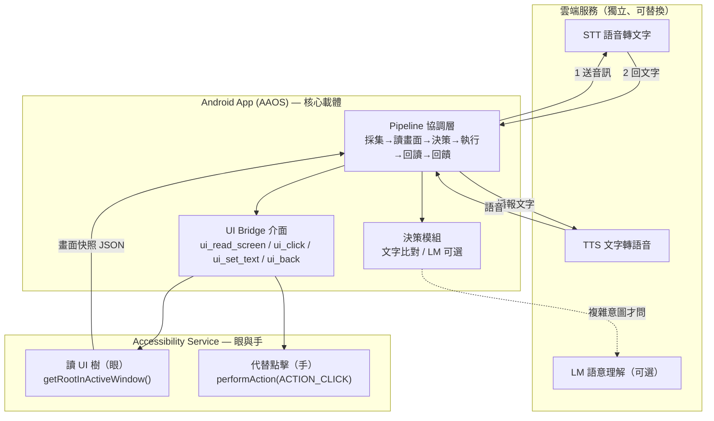
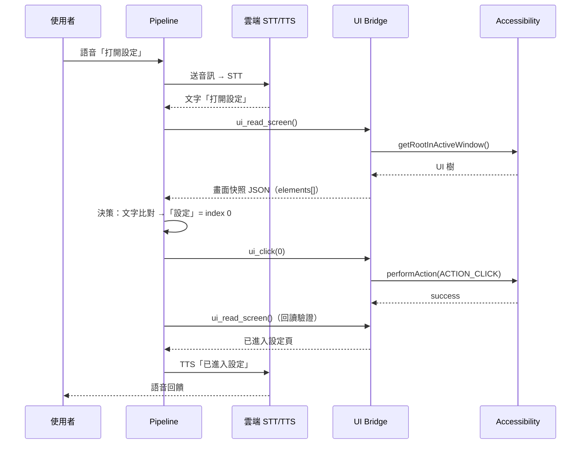

# AI 車載 IVI「所見即可說」智慧語音操控系統 — 技術文件

| 項目 | 內容 |
|---|---|
| 專案 | 2026 暑期實習專案 — 車用軟體研發處 |
| 期程 | 2026/07/15 – 08/07（前置 + 三個工作週） |
| 團隊 | Mark（Android / 整合）、Leo（STT / Android）、Rebecca（產品 / 測試 / 交付） |
| 文件狀態 | Draft v1 — 供 mentor 審閱 |

---

## 1. 專案摘要（Executive Summary）

一支跑在 **Android Automotive OS (AAOS)** 的原生 App，扮演「坐在副駕、看著螢幕、幫你動手」的語音助理，核心能力為 **聽 (Listen) → 看 (See) → 動手 (Act)**：使用者語音下達意圖，系統**即時讀取當前車機畫面**、決策後**代替使用者點擊**，並語音回饋結果。

**與 FoxMap 的根本差異**：不再為每個 App 寫死 HTTP API（盲操作），改以 **Android Accessibility Service** 建立**通用操作橋樑** — 讀 UI 樹（眼）、執行點擊（手），適用任意畫面的任意 UI 元素。

## 2. 問題背景與目標

### 2.1 問題背景
| 面向 | FoxMap（過去） | 本專案（現在） |
|---|---|---|
| 視覺感知 | 無（盲操作） | 先讀當前畫面（所見）再決策 |
| 操作對象 | 特定 App 寫死的 HTTP API | 任意畫面的任意 UI 元素（系統通用） |
| Client 載體 | 使用者的網頁瀏覽器 | 一支跑在 AAOS 的原生 Android App |

### 2.2 目標（Goals）
- G1：完成語音互動閉環（說 → 聽懂 → 回話）。
- G2：以無障礙服務讀畫面、代替點擊，並回讀驗證狀態改變。
- G3：整合語音與操作，達成「所見即可說」的**多步驟**任務閉環。

### 2.3 非目標（Non-Goals）
- 不追求泛用 NLU；簡單指令靠文字比對，LM 僅為輔助。
- 不自建 STT/TTS/LM 模型，皆串接既有雲端服務。
- 進度吃緊時放棄 FoxMap 改造與 LM，優先保住核心主線。

## 3. 系統架構

**決策在端上，雲端為輔助。** 核心是 App 內的 Pipeline 協調層；STT / LM（可選）/ TTS 為三個獨立雲端服務，由 App 各自串接；「眼與手」是同一支 App 內的 Accessibility Service。



### 3.1 元件職責
| 元件 | 職責 |
|---|---|
| Pipeline 協調層 | 串接各模組、驅動閉環、狀態機管理 |
| 決策模組 | 依畫面快照與指令，決定目標元素；簡單靠文字比對，複雜可問 LM |
| UI Bridge | 對上層暴露穩定介面，隔離無障礙實作細節 |
| Accessibility Service | 抽取 UI 樹、找節點、執行點擊/輸入/返回 |
| 雲端 STT/LM/TTS | 語音轉文字、語意理解（可選）、文字轉語音 |

## 4. 核心閉環（以「打開設定」為例）



> **多步驟任務 = 將此閉環連續跑多次**，每一步都依賴「當下的畫面」，而非預先寫死的腳本。

## 5. 介面契約（Interface Contract）

> **兩軌（語音 / 無障礙）平行開發的關鍵**：契約定版後兩端各自獨立實作與測試，整合只需接上同一份契約。**Week 1 結束前由 Leo + Mark 共同定版。**

### 5.1 UI Bridge 介面（Accessibility 層對上層）
```kotlin
interface UiBridge {
    /** 讀取當前畫面，回傳精簡元素快照 */
    fun uiReadScreen(): ScreenSnapshot

    /** 點擊指定 index 的元素 */
    fun uiClick(index: Int): ActionResult

    /** 對指定 index 的輸入框設定文字 */
    fun uiSetText(index: Int, text: String): ActionResult

    /** 返回上一頁 */
    fun uiBack(): ActionResult
}

data class ActionResult(val success: Boolean, val message: String? = null)
```

### 5.2 畫面快照資料格式（ScreenSnapshot JSON）
```json
{
  "screen": "home",
  "elements": [
    { "i": 0, "text": "設定", "clickable": true,  "bounds": [12, 340, 220, 96] },
    { "i": 1, "text": "音樂", "clickable": true,  "bounds": [12, 452, 220, 96] }
  ]
}
```
| 欄位 | 說明 |
|---|---|
| `screen` | 目前畫面識別（供決策/回讀比對） |
| `i` | 元素索引，Bridge 操作以此為 handle |
| `text` | 元素文字（決策文字比對主要依據） |
| `clickable` | 是否可點擊 |
| `bounds` | `[x, y, w, h]`，供除錯/座標點擊備援 |

### 5.3 語音層 → Pipeline 指令契約
- STT 回傳純文字字串（例：`"打開設定"`）。
- Pipeline 決策模組輸入 = `(指令文字, ScreenSnapshot)`，輸出 = `Action`（`click(index)` / `setText(index, text)` / `back()` / `noop`）。

## 6. 技術棧與開源參考

| 用途 | 資源 | 說明 |
|---|---|---|
| 語音 I/O（STT/TTS） | `android-docs-samples/speech` | 官方 gRPC streaming 範例 |
| **無障礙核心參考（最重要）** | `droidrun/mobilerun-portal` | 97% Kotlin，抽 UI 樹與執行點擊的完美參考 |
| 無障礙官方指南 | Google Accessibility Codelab | 建立 Service、宣告 manifest、`performAction` |
| 全雲端 Agent 備案 | `livekit-examples/agent-starter-android` | 若需走 LiveKit client 骨架 |

- 語言：Kotlin；平台：AAOS（模擬器優先，備援用一般手機/平板）。
- 關鍵 API：`AudioRecord`、`AccessibilityService`、`getRootInActiveWindow()`、`AccessibilityNodeInfo.performAction()`。

## 7. 里程碑與驗收標準

| 里程碑 | 內容 | 驗收標準（可量測） | 主責 |
|---|---|---|---|
| M1.1 | STT 串接 | 對 App 說話，畫面正確顯示辨識文字 | Leo |
| M1.2 | TTS 串接 | 傳入文字，喇叭正確念出 | Leo |
| **M1.3** | 語音互動 Loop（**主線**） | 說「你好」→ 聽懂 → 回覆 → 播報，全程自動 | Leo |
| M2.1 | 讀畫面 | 啟用服務後即時輸出當前畫面精簡元素清單 | Mark |
| M2.2 | 操作畫面 | 打字下「設定」，App 精準點開設定頁 | Mark |
| **M2.3** | 操作閉環（**主線**） | 點擊後自動回讀畫面、確認狀態已改變 | Mark |
| M3.1 | 單步執行 | 一句語音 → 完成單一動作閉環 + 回饋 | Mark / Leo |
| **M3.2** | 連續多步導航（**主線**） | 多步語音任務端到端跑通（如設定→顯示→字型調大） | Mark / Leo |
| M3.3 | 整合驗收 | 完整場景現場 Demo 通過 | 全員 |

> **核心保命主線：M1.3 → M2.3 → M3.2。** 三者跑通即達交付底線。

### 7.1 實戰目標
- **Target A — Car Settings（標準難度，主攻）**：語音「打開設定 → 顯示 → 字型調大」。標準 Android UI，原生支援 Accessibility。
- **Target B — FoxMap 改造（進階 / 選配）**：地圖多為自繪 UI，無障礙預設看不到 → 回 `kitt-map` 補 `contentDescription` 等語意標註，使其「可被看見與操作」。

## 8. 團隊分工與平行開發策略

**平行雙軌、不交棒**：語音 I/O 與 Accessibility Bridge 互相獨立，只在 Week 3 合流。Bridge 用打字/按鈕測試、語音 Loop 用對話測試，彼此不阻塞，故從 Week 1 同步開跑、負載交錯平均。

| 成員 | 主責條線 | Week 1 | Week 2 | Week 3 |
|---|---|---|---|---|
| **Leo** | 語音 I/O → Pipeline 層 | 🔴 STT/TTS/Loop | 🟡 Pipeline 層 + 效能 | 🔴 語音接線 + Target A |
| **Mark** | Accessibility Bridge + 整合 | 🟡 架構骨架 + M2.1 spike | 🔴 Bridge 四介面 | 🔴 M3.1→M3.2 整合 |
| **Rebecca** | 產品 / 測試 / 交付 | 🟢 場景/驗收/FoxMap 研究 | 🟢 清單格式/Debug 頁/測試案例 | 🟢 語意標註/Demo/簡報 |

## 9. 風險與備援

| 風險 | 影響 | 備援方案 |
|---|---|---|
| AAOS 模擬器不穩 | 阻塞開發 | 先用一般手機/平板測試 |
| 進度落後 | 無法交付 | 砍 Target B 與 LM，保住 M1.3→M2.3→M3.2 |
| 雲端服務延遲/不穩 | 閉環卡頓 | 先用預設規則文字比對；LM 延後；STT/TTS 串流化 |
| 自繪 UI 抓不到（FoxMap） | Target B 失敗 | 補 `contentDescription` 語意標註 |
| 兩軌整合介面不合 | Week 3 卡關 | Week 1 結束前共同定版介面契約（第 5 節） |

## 10. 交付成果包

- [ ] 可執行的 Android APK
- [ ] 完整程式碼 Repo
- [ ] 實戰操作 Demo 影片（展示「所見即可說」無縫流轉）
- [ ] 成果簡報（系統架構、遇到的坑與解決方案）

## 11. 給 Mentor 的待確認問題

1. 雲端 STT / TTS 服務指定哪一家？是否已有可用金鑰/額度？
2. AAOS 測試環境由誰提供？是否允許前期先用一般 Android 裝置開發？
3. LM 是否為必要項，或確認可列為選配？若需要，指定模型/服務為何？
4. FoxMap / `kitt-map` 的原始碼存取權限與 repo 位置？
5. 現場 Demo 驗收的日期與形式（每週五？最終週）？

---
*本文件與 `計劃表.md` 併行維護：技術決策以本文件為準，任務追蹤以計劃表為準。*
